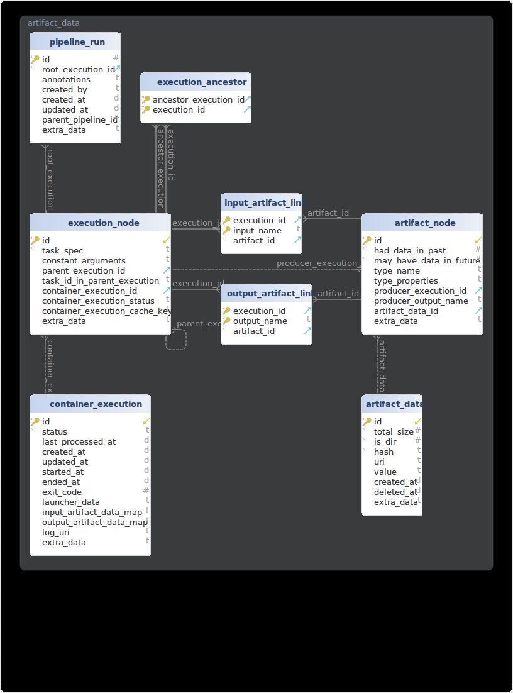

# Cloud Pipelines backend

Cloud Pipelines system helps users create and run ML experiments and production pipelines.
Any batch workflow that has beginning and end can be orchestrated via Cloud Pipelines.

## Details

The Cloud Pipelines system orchestrates containerized command-line programs.

The Cloud Pipelines system runs pipelines. It executes an interconnected graph of containerized programs locally or remotely (e.g. in cloud), and facilitates the transfer of data between them.

Pipelines are built from component tasks.

Each component describes a certain command-line program inside a container. Component specification describes its signature (inputs, outputs), metadata (name, description and annotations) and implementation which specifies which container image to use, which program to start and and how to connect the inputs and outputs to the program's command-line arguments.
Components can be written in any language. The Cloud Pipelines system supports arbitrary container and arbitrary programs.

A task describes an instance of a component and specifies the input arguments for the component's inputs. Tasks are connected together into a graph by linking some upstream task outputs to some downstream task inputs.

The resulting graph of interconnected tasks is called a pipeline.
A pipeline can be submitted for execution. During the pipeline execution, the pipeline's tasks are executed (in parallel, if possible) and produce output artifacts that are passed to downstream tasks.

## Installation

### Local installation

#### Using local Docker launcher

1. Install [Docker](https://www.docker.com/get-started/) and [uv](https://docs.astral.sh/uv/getting-started/installation/).
2. Download the app code:
```
git clone https://github.com/Cloud-Pipelines/backend.git cloud_pipelines_studio/backend --branch stable
git clone https://github.com/Cloud-Pipelines/pipeline-studio-app.git cloud_pipelines_studio/frontend_build --branch gh_pages_stable --single-branch --depth 1
```
3. Start the app:
```
cd cloud_pipelines_studio/backend && uv run fastapi run start_local.py
```

4. Once the "start_local: Starting the orchestrator" message appears in the terminal, open the [http://localhost:8000](http://localhost:8000) URL in a Web browser and start use the app.
Click the "New Pipeline" button at the top to start building a new pipeline.

## Design

This dedicated Cloud Pipelines backend consists of the API Server and the Orchestrator.

### API Server

The API Server receives API requests and accesses the database to fulfill them.
The API documentation can be accessed at [http://localhost:8000/docs](http://localhost:8000/docs).

### Orchestrator

The Orchestrator works independently from the API Server.
It launches container executions and facilitates data passing between executions.
The Orchestrator and the API Server communicate via the database.
The Orchestrator launches container tasks using a specified Launcher, communicating with it via abstract interface. Such flexibility helps support different container execution systems and cloud providers.

### Database

The backend uses SqlAlchemy to abstract the database access, so any database engine supported by SqlAlchemy can be used.
We officially support the Sqlite and MySQL databases.



### Launchers

Launchers launch container executions on a local or remote computer.
Currently the following launchers are supported:

* Local Docker using local storage
* Local Kubernetes using local storage via HostPath volumes
* Google Cloud Kubernetes Engine using Google Cloud Storage

More launchers may be added in the future.
